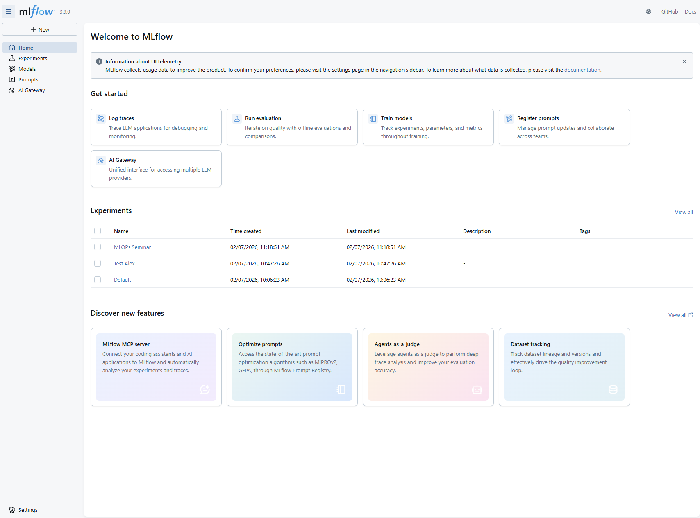

# The Lifecycle of AI: Moving from Research to Industry-Grade MLOps. Lab Session.

This README contains all instructions for the practical part of the workshop *The Lifecycle of AI: Moving from Research to Industry-Grade MLOps*.


Document Index:

1. [Introduction](#introduction)
2. [Prerequisites](#prerequisites)
3. [Execution Environment Setup](#execution-environment-setup)
   - [Connection to AWS Instances](#connection-to-aws-instances)
   - [Docker Installation Verification](#docker-installation-verification)
   - [Using the Makefile](#using-the-makefile)
4. [Running Docker](#running-docker)
   - [Building the Docker Image](#building-the-docker-image)
   - [Creating the Docker Container](#creating-the-docker-container)
5. [Browsing MLflow](#browsing-mlflow)
6. [Running Training](#running-training)
   - [Dataset Download](#dataset-download)
   - [Model Training](#model-training)
   - [Dataset Update](#dataset-update)
7. [Hydra Configuration Files](#hydra-configuration-files)
8. [Contact](#contact)

## Introduction

This file guides you through the lab session for the MLOps seminar. The primary objective is to get hands-on experience with some of the tools introduced during the theoretical lecture. Specifically, we will focus on managing dataset versions with DVC and tracking our training experiments using MLflow.

We will start by running a set of predefined experiments so you can familiarize yourself with a standard MLOps workflow. Following this, you will transition into an exploratory training phase. Your main goal here will be to train the best possible model, leveraging MLflow to guide your development and compare different iterations.

## Prerequisites

Below are the only requirements to complete the workshop:

- Visual Studio Code
- VS Code Remote - SSH extension

## Execution Environment Setup

### Connection to AWS Instances

Instructions on how to connect to AWS instances can be found in the guidelines in Moodle.

Please, make sure you are already connected to your assigned AWS instance before continuing.

### Docker Installation Verification

To verify that Docker is correctly installed, run:

```bash
docker run hello-world
```

If the installation is correct, you should see the following output:

<details>
<summary>Example Output</summary>

```text
Hello from Docker!
This message shows that your installation appears to be working correctly.

To generate this message, Docker took the following steps:
 1. The Docker client contacted the Docker daemon.
 2. The Docker daemon pulled the "hello-world" image from the Docker Hub.
    (amd64)
 3. The Docker daemon created a new container from that image which runs the
    executable that produces the output you are currently reading.
 4. The Docker daemon streamed that output to the Docker client, which sent it
    to your terminal.

To try something more ambitious, you can run an Ubuntu container with:
 $ docker run -it ubuntu bash

Share images, automate workflows, and more with a free Docker ID:
 https://hub.docker.com/

For more examples and ideas, visit:
 https://docs.docker.com/get-started/
```

</details>

### Using the Makefile

To simplify Docker command execution, the main commands are included in the [Makefile](https://github.com/alexlopezcifuentes/IPCV-MLOPs-Seminary/blob/main/Makefile).

`Makefile`s let you run longer commands through simple shortcuts. The AWS instances used in this workshop should already have `make` installed. You can verify this by running:

```bash
make --version
```

You should see output like this:

<details>
<summary>Make Check Output</summary>

```text
GNU Make 4.3
Built for x86_64-pc-linux-gnu
Copyright (C) 1988-2020 Free Software Foundation, Inc.
License GPLv3+: GNU GPL version 3 or later <http://gnu.org/licenses/gpl.html>
This is free software: you are free to change and redistribute it.
There is NO WARRANTY, to the extent permitted by law.
```
</details>


## Running Docker

As mentioned, this repository uses `make` commands. A help file with useful Docker commands is also available in the [Docker Cheatsheet](https://github.com/alexlopezcifuentes/IPCV-MLOPs-Seminary/blob/main/DockerCheatsheet.md).

### Building the Docker Image

As explained during the introduction, we do not want to run our code directly on the AWS instance operating system. It is more convenient to run everything inside a Docker container.

To do so, first we need to build the Docker image using the recipe defined in the [Dockerfile](Dockerfile):

```bash
make docker-build
```

You will see the following output:

<details>
<summary>Example Output</summary>

```text
# Build a Docker image
# -t mlops-seminary:latest    # Name and tag the image as 'mlops-seminary:latest'
# .                           # Use Dockerfile in current directory
docker build -t alexlopezcifuentes/ipcv-mlops:latest .
[+] Building 1.0s (12/12) FINISHED                                                                                                                                                                                         docker:default
 => [internal] load build definition from Dockerfile                                                                                                                                                                                      
 => => transferring dockerfile: 545B                                                                                                                                                                                            
 => [internal] load metadata for docker.io/library/python:3.10-slim                                                                                                                                                                                         
 => [internal] load .dockerignore                                                                                                                                                                                    
 => => transferring context: 72B                                                                                                                                                                                             
 => [internal] load build context                                                                                                                                                                                         
 => => transferring context: 38B                                                                                                                                                                                             
 => [1/7] FROM docker.io/library/python:3.10-slim@sha256:f5d029fe39146b08200bcc73595795ac19b85997ad0e5001a02c7c32e8769efa                                                                                                                 
 => => resolve docker.io/library/python:3.10-slim@sha256:f5d029fe39146b08200bcc73595795ac19b85997ad0e5001a02c7c32e8769efa                                                                                                                 
 => CACHED [2/7] RUN apt-get update -y && apt-get upgrade -y && apt-get install -y build-essential ffmpeg libsm6 libxext6 git nano jq cmake libzbar0                                                                                                                                                                                        
 => CACHED [3/7] RUN pip install uv                                                                                                                                                                                              
 => CACHED [4/7] WORKDIR /app                                                                                                                                                                                             
 => CACHED [5/7] COPY requirements.txt .                                                                                                                                                                                           
 => CACHED [6/7] RUN uv pip install -r requirements.txt --system                                                                                                                                                                                        
 => CACHED [7/7] RUN git config --global --add safe.directory /app                                                                                                                                                                                             
 => exporting to image                                                                                                                                                                                           
 => => exporting layers                                                                                                                                                                                          
 => => exporting manifest sha256:0f25d7ef21aa1f57a7fad8b10f4712303da6a253599403576fe390fa019e283a                                                                                                                         
 => => exporting config sha256:c4a6a08b3868eebd3e8b971a69051c63cc03eb78bf4c0d14dac16a783791593e                                                                                                                         
 => => exporting attestation manifest sha256:747e8ce43de515b28b055fe2b33fbf698c895dc346949df9325e6f090f527287                                                                                                                         
 => => exporting manifest list sha256:de8b8a01b35395974fb8725dc0a45ea943fd868a9974165bb2fd45eaecc548e9                                                                                                                         
 => => unpacking to docker.io/alexlopezcifuentes/ipcv-mlops:latest        
 => => naming to docker.io/alexlopezcifuentes/ipcv-mlops:latest
```

</details>

> **Note**: Due to compute limitations, this process may take about 2-3 minutes. Once the Docker image is built, it remains available on the system, so you do not need to build it again unless you change the image definition.

> **Note**: We are using the `Makefile` as a shortcut for the underlying Docker commands. Take a minute to inspect the real commands in the [Makefile](Makefile).

### Creating the Docker Container

Once the image is created, you can create a Docker container for your working environment by running:

```bash
make docker-run
```

After the container is created, you will automatically enter it. You should see output like:

<details>
<summary>Example Output</summary>

```text
(SeminarioIPCV) (base) ➜  Seminario MLOPs git:(main) ✗ make docker-run               
# Run a Docker container from the image
# -it                         # Interactive mode with terminal
# --rm                        # Remove container when it exits
# --name mlops-seminary-container  # Name the running container
# -v "/home/alex/Personal/Seminario MLOPs:/app"           # Mount current directory to /app in container
# -p 5000:5000               # Map port 5000 of host to port 5000 of container
# alexlopezcifuentes/ipcv-mlops:latest      # Use the latest version of our image
docker run -it --rm --name mlops-seminary-container -v "/home/alex/Personal/Seminario MLOPs:/app" -p 5000:5000 alexlopezcifuentes/ipcv-mlops:latest
root@2fe34d8b86f1:/app# 
```

</details>

Up to this point, every command we run in the terminal is executed inside the Docker container. Remember: we connect from our local computers to AWS through SSH, and inside the AWS instance we run commands in a Docker container.

If we look closely at the `Makefile` that we are executing when we do `make docker-run`, we can observe the following argument:

```bash
-v "$(PWD):/app"
```

This means we are mounting our working directory (`PWD`) inside the `/app` folder of the Docker container. This way, all files in the repository are shared between the AWS host and the Docker container.

You can test this by creating a `test.txt` file from the VSCode Explorer and then running `ls` inside the Docker container. You will see it synchronized immediately.

> **Note**: Up to this point, every command we run in the terminal is executed inside the Docker container. Remember: we connect from our local computers to AWS through SSH, and inside the AWS instance we run commands in a Docker container. If the container breaks, you can simply delete it and recreate it. That's the magic.


## Browsing MLflow

The MLflow server runs on a dedicated AWS instance hosted by Alex so everyone logs training runs to the same place and can compare results.

You can access the web interface at [MLflow Server](http://35.181.155.85) from any browser. You should see an interface like this:



## Running Training

Now we move into the experimental part of the workshop. We have already set up the execution environment (AWS, Docker, and MLflow), so we can start running model training experiments.

### Dataset Download

We will use DVC to manage and download the dataset used to train the model. This repository contains two tagged dataset versions:

- `cifar10_v1.0.0`: First CIFAR-10 version, missing images from some classes in the training set.
- `cifar10_v2.0.0`: Second CIFAR-10 version with the complete dataset.

You can see repository tags in [the tag list](https://github.com/alexlopezcifuentes/IPCV-MLOPs-Seminary/tags). This is a key feature that lets us keep datasets versioned in the same repository.

To download version `1.0.0`, run from the repository root:

```bash
cd datasets
git checkout cifar10_v1.0.0 -- cifar10.dvc
dvc pull cifar10.dvc
cd ..
```

During the dataset download, you should see output like:

<details>
<summary>Example Output</summary>

```text
root@3f3f51185b33:/app/datasets# dvc pull cifar10.dvc 
Collecting                                                                                                                            |60.0k [00:02, 26.9kentry/s]
Fetching
Building workspace index                                                                                                                |1.00 [00:00,  935entry/s]
Comparing indexes                                                                                                                      |60.0k [00:00, 129kentry/s]
Applying changes                                                                                                                       |60.0k [00:17, 3.48kfile/s]
A       cifar10/
1 file added
```

</details>

Once the download is complete (about 4 minutes), you should have the following file structure. Even though you downloaded it from inside the Docker container, the mounted volume automatically synchronizes it with the AWS host file system. That means you can inspect the dataset from VS Code Explorer:

```text
datasets/
└── cifar10/
    ├── train/         # Directory with training images
    ├── train.txt      # Metadata file for training
    ├── val/           # Directory with validation images
    └── val.txt        # Metadata file for validation
```

### Model Training

The repository includes a simple training pipeline. To start training, run:

```bash
python main.py experiment_name='<YOUR_NAME>'
```

Where `<YOUR_NAME>` can be something like `Alex Lopez`. This will be your MLflow experiment name. It is highly important that you always use the same name.

You will see the training process begin with output like:

<details>
<summary>Example Output</summary>

```text
root@3f3f51185b33:/app# python main.py 
2025-03-18 15:16:08.219 | INFO     | src.dataloader:__init__:13 - Initiating Dataloader for stage: train
2025-03-18 15:16:08.219 | INFO     | src.dataloader:set_dataset:29 - Using cifar10 dataset
2025-03-18 15:16:08.357 | INFO     | src.dataloader:__init__:13 - Initiating Dataloader for stage: val
2025-03-18 15:16:08.357 | INFO     | src.dataloader:set_dataset:29 - Using cifar10 dataset
2025-03-18 15:16:08.439 | INFO     | src.model:__init__:84 - Instantiating Model
2025-03-18 15:16:08.439 | INFO     | src.model:__init__:94 - Device to be used: cpu
2025-03-18 15:16:08.440 | INFO     | src.model:set_model:112 - Initiating Model: alexnet
2025-03-18 15:16:08.441 | INFO     | src.loss:__init__:24 - Instantiating Loss
2025-03-18 15:16:08.441 | INFO     | src.loss:__init__:39 - Setting ignore_index to 11
2025-03-18 15:16:08.441 | INFO     | src.loss:set_loss:47 - Initiating loss: crossentropy
2025-03-18 15:16:08.441 | INFO     | src.optimizer:set_optimizer:61 - Initiating optimizer: sgd
2025-03-18 15:16:08.442 | INFO     | src.optimizer:set_scheduler:69 - Initiating scheduler: step
2025-03-18 15:16:08.442 | INFO     | src.runners:__init__:25 - Instantiating Runner
2025-03-18 15:16:08.443 | INFO     | src.runners:complete_train:48 - Starting complete training...
2025-03-18 15:16:08.443 | INFO     | src.runners:complete_train:51 - Epoch 1 of 5
2025-03-18 15:16:08.443 | INFO     | src.runners:complete_train:54 - Training step...
2025-03-18 15:16:09.065 | INFO     | src.runners:epoch_train:119 - [Epoch 1/5,     1/469]. Loss: 2.300. Accuracy: 0.125
2025-03-18 15:16:10.790 | INFO     | src.runners:epoch_train:119 - [Epoch 1/5,   101/469]. Loss: 2.034. Accuracy: 0.243
```

</details>

> **Note**: Given the available compute resources, training for 5 epochs takes about 4 minutes.

In MLflow, an experiment run with the information from this execution will be created automatically. This model will serve as a baseline for later comparisons.

### Dataset Update

Once the baseline is trained, we will train with an updated dataset version. To download dataset version `cifar10_v2.0.0`, run from the repository root:

```bash
cd datasets
git checkout cifar10_v2.0.0 -- cifar10.dvc
dvc pull cifar10.dvc
cd ..
```

In this case, download time will be much shorter because DVC knows that we already have some CIFAR images and it will only download the new ones from `2.0.0`. Once the new version is downloaded, you can start a new training run with:

```bash
python main.py experiment_name='<YOUR_NAME>'
```

Remember to use the same `<YOUR_NAME>` as in the first training so the new run is logged under the same MLflow experiment.

You will see that a new entry is generated that you can compare with the previous training.

## Hydra Configuration Files

When running this Python command:

```bash
python main.py experiment_name='<YOUR_NAME>'
```

We are using all the default configuration arguments set in the [Hydra config folder](https://github.com/alexlopezcifuentes/IPCV-MLOPs-Seminary/tree/main/config).

Please go to the [Hydra config folder](https://github.com/alexlopezcifuentes/IPCV-MLOPs-Seminary/tree/main/config) to find detailed Hydra documentation on how to change hyperparameters, with examples.

## Contact

If you have any questions, email [alexlopezcifuentes.93@gmail.com](mailto:alexlopezcifuentes.93@gmail.com) or [alex.lopez@xoople.com](mailto:alex.lopez@xoople.com).

Disclaimer: This code is protected by copyright and cannot be used or reproduced without the explicit consent of Alejandro López Cifuentes.
