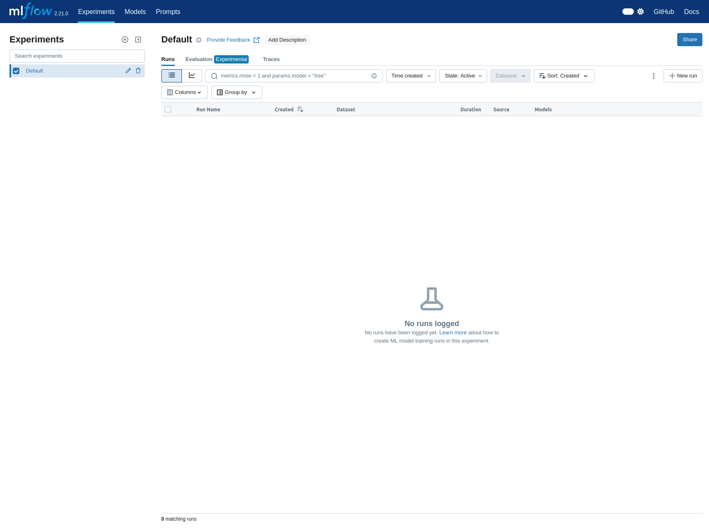

# Workshop Machine Learning Operations (MLOPs)

This README file contains all the instructions to carry out the practical part of the workshop How to Train DL Models and Deploy Them at Scale:
Machine Learning Operations.

The document index is:
1. Prerequisites
2. Execution Environment Setup
   - Docker Installation Verification
   - Using Makefile
   - Repository Cloning
3. Running Docker
   - Downloading the Docker Image
   - Creating the Docker Container
   - Accessing the Container
4. Running MLFlow
5. Running Training
   - Dataset Download
   - Model Training
   - Dataset Update
   - Modifying Hyperparameters with Hydra
     - Selecting Configuration Files
     - Modifying Individual Parameters
     - Automatic Execution of Multiple Runs
6. Contact

## Prerequisites
Below is the only requirement needed to carry out the workshop:
- Docker

## Execution Environment Setup

### Docker Installation Verification
To verify that Docker is correctly installed, run:

```bash
docker run hello-world
```

If the installation is correct, you should see the following output:

<details>
<summary>Example Output</summary>

```text
Hello from Docker!
This message shows that your installation appears to be working correctly.

To generate this message, Docker took the following steps:
 1. The Docker client contacted the Docker daemon.
 2. The Docker daemon pulled the "hello-world" image from the Docker Hub.
    (amd64)
 3. The Docker daemon created a new container from that image which runs the
    executable that produces the output you are currently reading.
 4. The Docker daemon streamed that output to the Docker client, which sent it
    to your terminal.

To try something more ambitious, you can run an Ubuntu container with:
 $ docker run -it ubuntu bash

Share images, automate workflows, and more with a free Docker ID:
 https://hub.docker.com/

For more examples and ideas, visit:
 https://docs.docker.com/get-started/
```

</details>

### Using Makefile

To facilitate the execution of the different commands needed, these are included in the [Makefile](https://github.com/alexlopezcifuentes/IPCV-MLOPs-Seminary/blob/main/Makefile) file.

`Makefile` files allow you to execute complex syntax commands using simple shortcuts. The virtual machines we are using do not come with `Make` installed by default. To install it, we should run:
```bash
sudo apt install build-essential
```
When using sudo, a password will be requested, which is the same as the virtual machine's username.

### Repository Cloning

To get the seminar code and have access to git functions, clone the repository by running:

```bash
git clone https://github.com/alexlopezcifuentes/IPCV-MLOPs-Seminary.git
```
> **Note**: It is important to clone the repository and not download it directly as a .zip from GitHub for everything to work correctly.

## Running Docker
As mentioned, this repository uses `make` commands. However, this repository includes a help file with some of the most useful Docker commands explained. You can view it in [Docker Cheatsheet.](https://github.com/alexlopezcifuentes/IPCV-MLOPs-Seminary/blob/main/DockerCheatsheet.md)

### Downloading the Docker Image

In this workshop, due to computational and time limitations of virtual machines, we will use a created Docker image available on Docker Hub. The image can be found at [MLOPS-Docker-Image](https://hub.docker.com/repository/docker/alexlopezcifuentes/ipcv-mlops/general).

You can download the image using:
```bash
make docker-pull-image
```

You will see the following output:

<details>
<summary>Example Output</summary>

```text
(SeminarioIPCV) (base) ➜  Seminario MLOPs git:(main) ✗ make docker-pull-image
docker pull alexlopezcifuentes/ipcv-mlops:latest
latest: Pulling from alexlopezcifuentes/ipcv-mlops
6e909acdb790: Pull complete 
a8053d65de8e: Pull complete 
806331b0d260: Pull complete 
ce054015c4fb: Pull complete 
a2e2c0a43e8a: Pull complete 
97b6d233f75c: Pull complete 
290bd27e9691: Pull complete 
d808312cb37f: Pull complete 
a1565cad2848: Pull complete 
Digest: sha256:235d16c65c3e50d0373ecc214c574de51f911fa7079a73e76a50f7e3a3d0cd3d
Status: Downloaded newer image for alexlopezcifuentes/ipcv-mlops:latest
docker.io/alexlopezcifuentes/ipcv-mlops:latest
```

</details>

> **Note**: Due to virtual machine limitations, this process may take about 5 minutes. Once the Docker image is downloaded, we will have it permanently in our system, so if we need to using it again, there will be no need to download it.

> **Note 2**: Although it's not necessary to build the image, the repository includes the `Dockerfile` and the corresponding instruction in the `Makefile` so that you can examine/use it.

### Creating the Docker Container

To run the environment where we will work, create a Docker container with the provided image by running:

```bash
make docker-run
```

If the image is not available locally, Docker will automatically download it from Docker Hub. Once the contaner is created and you will access it. You should see an output like:
<details>
<summary>Example Output</summary>

```text
(SeminarioIPCV) (base) ➜  Seminario MLOPs git:(main) ✗ make docker-run               
# Run a Docker container from the image
# -it                         # Interactive mode with terminal
# --rm                        # Remove container when it exits
# --name mlops-seminary-container  # Name the running container
# -v "/home/alex/Personal/Seminario MLOPs:/app"           # Mount current directory to /app in container
# -p 5000:5000               # Map port 5000 of host to port 5000 of container
# alexlopezcifuentes/ipcv-mlops:latest      # Use the latest version of our image
docker run -it --rm --name mlops-seminary-container -v "/home/alex/Personal/Seminario MLOPs:/app" -p 5000:5000 alexlopezcifuentes/ipcv-mlops:latest
root@2fe34d8b86f1:/app# 
```

</details>


If we look closely at the `Makefile` that we are executing when we do `make docker-run`, we can observe the following argument:

```bash
-v "$(PWD):/app"
```
this means that we are mounting our `WD` (working directory), inside the `app` folder of the Docker container. This way, all the files we have in the repository folder are shared by both our local system and the Docker container.

You can try creating a `test.txt` file from the virtual machine's file explorer and then do `ls` inside the Docker container, you'll see that it syncs immediately.

### Accessing the Container

At this point, you should have a terminal inside the Docker container. For the seminar, you will need a second terminal within the same container. To open this second terminal, run the following command in a new terminal window:

```bash
make docker-enter-container
```

Now you should have two terminals, which we will call **Terminal 1** and **Terminal 2**, running inside the Docker container.

## Running MLFlow

In **Terminal 1**, we can start the MLFlow server and its interface by running:

```bash
make run-mlflow-ui
```

<details>
<summary>Example Output</summary>

```text
root@3f3f51185b33:/app# make run-mlflow-ui
# Run MLflow's tracking UI server
# --host 0.0.0.0              # Make server accessible on all network interfaces
# --port 5000                 # Set the port to 5000
mlflow ui --host 0.0.0.0 --port 5000
[2025-03-18 15:12:21 +0000] [57] [INFO] Starting gunicorn 23.0.0
[2025-03-18 15:12:21 +0000] [57] [INFO] Listening at: http://0.0.0.0:5000 (57)
[2025-03-18 15:12:21 +0000] [57] [INFO] Using worker: sync
[2025-03-18 15:12:21 +0000] [58] [INFO] Booting worker with pid: 58
[2025-03-18 15:12:21 +0000] [59] [INFO] Booting worker with pid: 59
[2025-03-18 15:12:21 +0000] [60] [INFO] Booting worker with pid: 60
[2025-03-18 15:12:21 +0000] [61] [INFO] Booting worker with pid: 61
```
</details>

You can access the web interface at [http://0.0.0.0:5000/](http://0.0.0.0:5000/) from the virtual machine's browser. You should see an interface like the following:




After starting MLFlow, you can minimize **Terminal 1**, as we won't use it anymore.

> **Note**: Just minimize the terminal, don't close it, as doing so will stop the MLFlow server and you won't be able to access it.


## Running Training

From this point on, we will exclusively use **Terminal 2** for all the following commands.

### Dataset Download

We will use DVC to manage and download the dataset we will use to train our model. This repository contains two tagged versions of the dataset:

- `cifar10v1.0.0`: First version of CIFAR10 without images of some classes in the training set:
- `cifar10v2.0.0`: Second version of CIFAR10 using the complete dataset.

You can see the repository tags in [the tag listing](https://github.com/alexlopezcifuentes/IPCV-MLOPs-Seminary/tags). This is a key functionality that allows us to have correctly versioned datasets under the same repository.

To download version `1.0.0`, run from the repository root:

```bash
cd datasets
git checkout cifar10_v1.0.0
dvc pull cifar10
cd ..
```

During the dataset download, we should see the following output:

<details>
<summary>Example Output</summary>

```text
root@3f3f51185b33:/app/datasets# dvc pull cifar10.dvc 
Collecting                                                                                                                            |60.0k [00:02, 26.9kentry/s]
Fetching
Building workspace index                                                                                                                |1.00 [00:00,  935entry/s]
Comparing indexes                                                                                                                      |60.0k [00:00, 129kentry/s]
Applying changes                                                                                                                       |60.0k [00:17, 3.48kfile/s]
A       cifar10/
1 file added
```
</details>


Once the download is complete, you should have the following file structure. You can view it from the virtual machine's file explorer. Remember that although we downloaded it from the Docker container, having the volume mounted automatically synchronizes it with our local file system:

```
datasets/
└── cifar10/
    ├── train/         # Directory with training images
    ├── train.txt      # Metadata file for training
    ├── val/           # Directory with validation images
    └── val.txt        # Metadata file for validation
```

### Model Training
The repository has a simple training pipeline that you can
To start training, run:

```bash
python main.py
```

You will see how the training process begins, showing the following output:

<details>
<summary>Example Output</summary>

```text
root@3f3f51185b33:/app# python main.py 
2025-03-18 15:16:08.219 | INFO     | src.dataloader:__init__:13 - Initiating Dataloader for stage: train
2025-03-18 15:16:08.219 | INFO     | src.dataloader:set_dataset:29 - Using cifar10 dataset
2025-03-18 15:16:08.357 | INFO     | src.dataloader:__init__:13 - Initiating Dataloader for stage: val
2025-03-18 15:16:08.357 | INFO     | src.dataloader:set_dataset:29 - Using cifar10 dataset
2025-03-18 15:16:08.439 | INFO     | src.model:__init__:84 - Instantiating Model
2025-03-18 15:16:08.439 | INFO     | src.model:__init__:94 - Device to be used: cpu
2025-03-18 15:16:08.440 | INFO     | src.model:set_model:112 - Initiating Model: alexnet
2025-03-18 15:16:08.441 | INFO     | src.loss:__init__:24 - Instantiating Loss
2025-03-18 15:16:08.441 | INFO     | src.loss:__init__:39 - Setting ignore_index to 11
2025-03-18 15:16:08.441 | INFO     | src.loss:set_loss:47 - Initiating loss: crossentropy
2025-03-18 15:16:08.441 | INFO     | src.optimizer:set_optimizer:61 - Initiating optimizer: sgd
2025-03-18 15:16:08.442 | INFO     | src.optimizer:set_scheduler:69 - Initiating scheduler: step
2025-03-18 15:16:08.442 | INFO     | src.runners:__init__:25 - Instantiating Runner
2025-03-18 15:16:08.443 | INFO     | src.runners:complete_train:48 - Starting complete training...
2025-03-18 15:16:08.443 | INFO     | src.runners:complete_train:51 - Epoch 1 of 5
2025-03-18 15:16:08.443 | INFO     | src.runners:complete_train:54 - Training step...
2025-03-18 15:16:09.065 | INFO     | src.runners:epoch_train:119 - [Epoch 1/5,     1/469]. Loss: 2.300. Accuracy: 0.125
2025-03-18 15:16:10.790 | INFO     | src.runners:epoch_train:119 - [Epoch 1/5,   101/469]. Loss: 2.034. Accuracy: 0.243
```
</details>

In MLFlow, we will see how an experiment with the information from this execution will be automatically created. This model will serve as a baseline for later comparisons.


### Dataset Update

Once we have trained our baseline, we will train with an updated version of our dataset. To download version 2.0.0 of the dataset, run from the repository root:

```bash
cd datasets
git checkout cifar10_v2.0.0
dvc pull cifar10
cd ..
```

Once the new version is downloaded, you can start a new training with:

```bash
python main.py
```

You will see that a new entry is generated in the same MLFlow experiment that you can compare with the previous training.

## Hydra Configuration Files


We can run different trainings by modifying the hyperparameters. All hyperparameters are defined inside the `/config` folder. They are organized by categories to facilitate their use.

In the code, these hyperparameters are read, instead of using typical argparse arguments, using a library called [Hydra](https://hydra.cc/docs/intro/). Hydra allows dynamically creating a hierarchical configuration through composition and modifying it through configuration files and the command line.


### Modifying Hyperparameters with Hydra
#### Selecting Configuration Files
In certain folders, we can see that there is more than one configuration file. One of the strengths of Hydra is being able to have different configurations for the same category.
For example, inside `/config/model` we have two configuration files for two different architectures:

AlexNet
```yaml
name: alexnet
n_classes: ${dataset.n_classes}
normalization: True
```

ResNet
```yaml
name: resnet18
n_classes: ${dataset.n_classes}
normalization: False
```
Using Hydra, we can easily maintain different configurations for each of the architectures. To select which architecture we want to use, we have two ways:

The first will be to run the following command:
```bash
python main.py model=resnet
```

The second will be to modify the configuration files used by default. This information is contained in the configuration file `config/config.yaml`:

```yaml
defaults:
  - dataset: cifar10
  - model: alexnet
  - optimizer: sgd
  - optimizer/loss: cross_entropy
  - optimizer/scheduler: step
  - training: pc
  - _self_
```


#### Modifying Individual Parameters

If we modify one of the files, for example, `/config/training/pc.yaml` from:

```yaml
epochs: 5
batch_size: 64
n_workers: 14
device: "cpu"
gpu_id: 0
seed: 42
print_freq: 100
```
to 
```yaml
epochs: 10
batch_size: 64
n_workers: 14
device: "cpu"
gpu_id: 0
seed: 42
print_freq: 100
```
we will be modifying the number of epochs we train our model.
Similarly, if instead of modifying the file, we run
```bash
python main.py training.epochs=10
```
we will be overriding the default value and also training for 10 epochs.

#### Automatic Execution of Multiple Runs

One of the main advantages of Hydra over ArgParse arguments, besides the organization of configurations, is the possibility of automatically defining sweepers over hyperparameters.

If one wants to evaluate the influence of the number of epochs 5, 10, 25, on the model's performance, we can train the model three times by modifying that parameter. However, Hydra gives us the possibility to modify our `config/config.yaml` file and add:

```yaml
hydra:
  sweeper:
    params:
      training.epochs: 5, 10, 25
```

If additionally we run `main.py` using the `-m` argument:
```bash
python main.py -m
```
We will observe how 3 runs are automatically executed one after the other.

If in addition to the number of epochs, we want to measure the impact of the learning rate, we can modify `config/config.yaml` as follows:
```yaml
hydra:
  sweeper:
    params:
      training.epochs: 5, 10, 25
      optimizer.lr: 0.001, 0.01, 0.1
```
and when running `python main.py -m` we will see how we are automatically executing 9 runs. Each of these runs will have its own entry in MLFlow, greatly simplifying the search for optimal hyperparameters.

We can even define sweepers over complete configurations or ranges.
```yaml
hydra:
  sweeper:
    params:
      model: alexnet, testnet
      training.epochs: range(1,10)  
      optimizer.lr: 0.001, 0.01, 0.1
```

> **Note**: This way of using sweepers is the manual form. Hydra has functionalities to integrate more complex algorithms for optimal hyperparameter search such as [Nevergrad](https://hydra.cc/docs/plugins/nevergrad_sweeper/) or [Optuna](https://hydra.cc/docs/plugins/optuna_sweeper/).


## Contact
In case of any questions, you can send an email to alexlopezcifuentes.93@gmail.com

Disclaimer: This code is protected by copyright and cannot be used or reproduced without the explicit consent of Alejandro López Cifuentes.